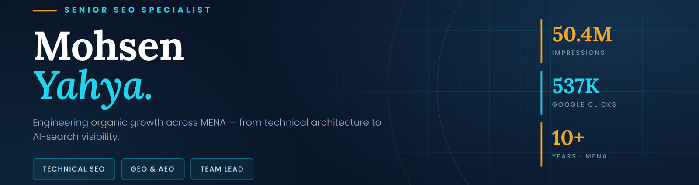
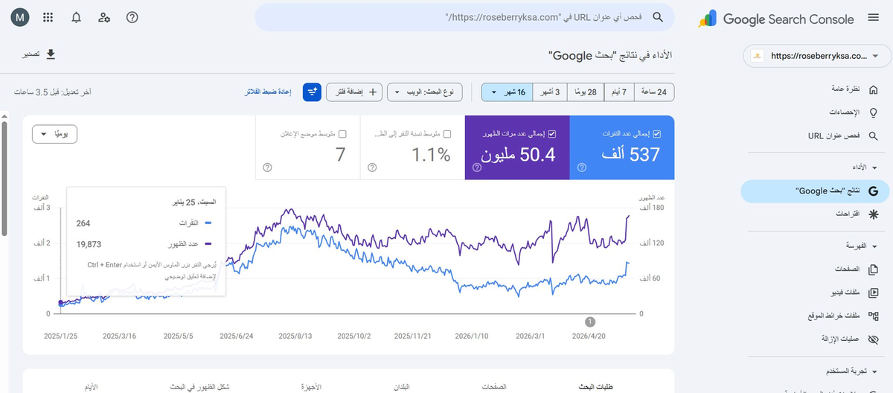
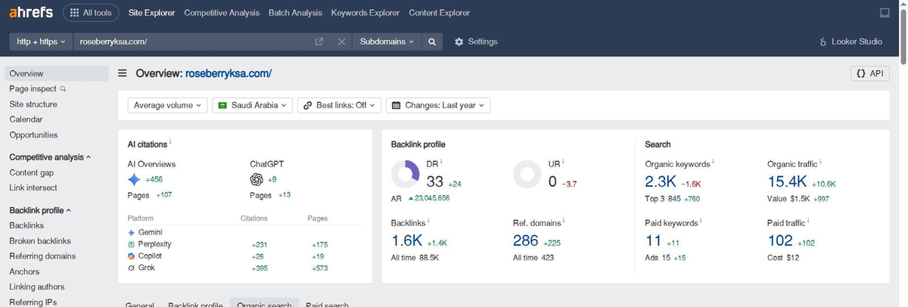
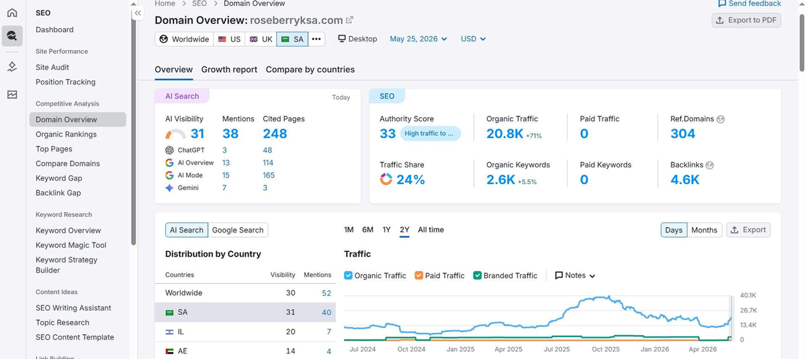
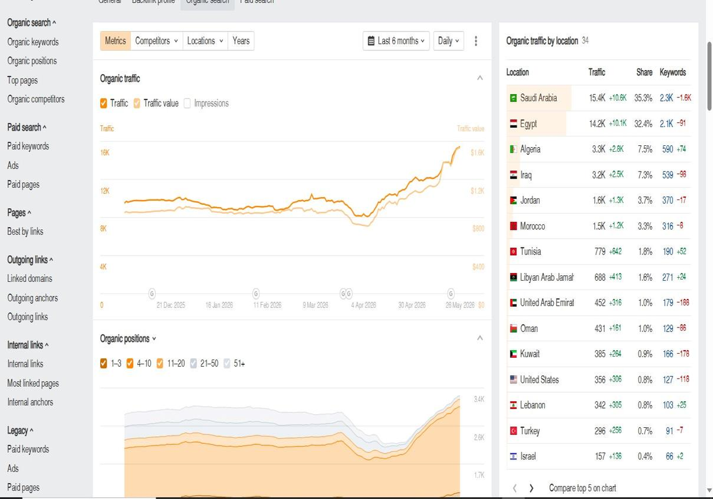
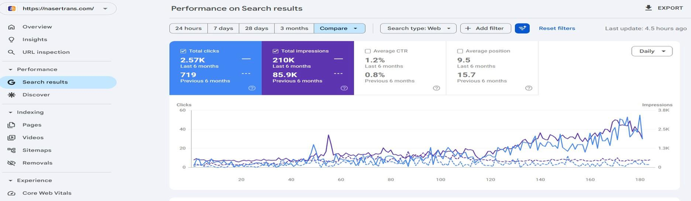
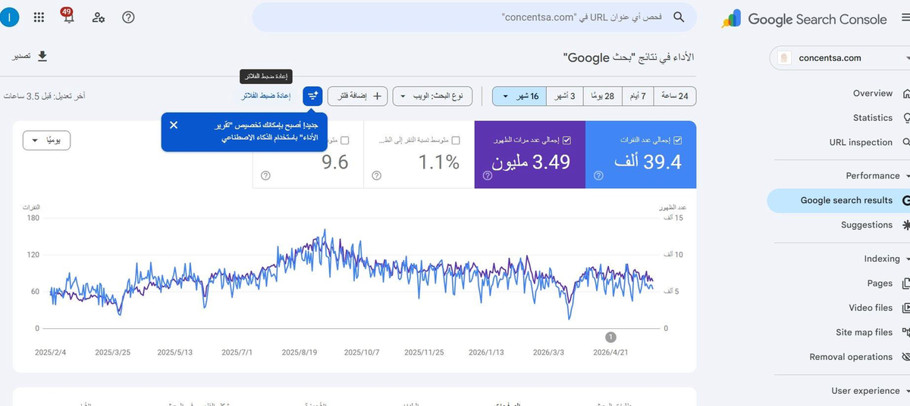
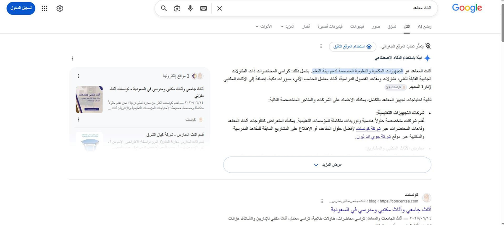
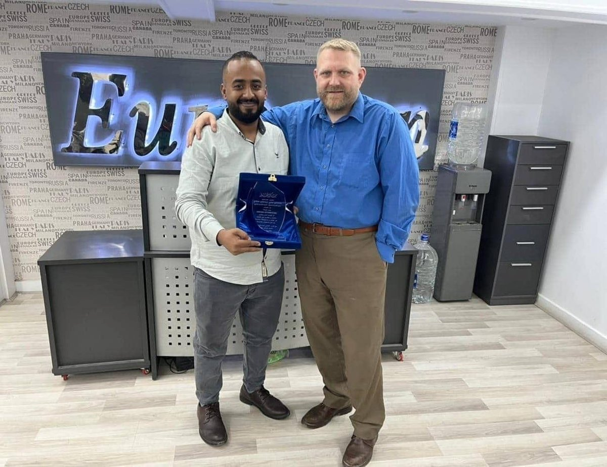

<div align="center">



<br/>

[](https://myfactfrontier.github.io)
[](mailto:nobein677@gmail.com)
[](https://wa.me/201111793633)
[](#)

</div>

---

## A decade of compounding organic growth

I'm **Mohsen Yahya** — an SEO strategist who treats organic visibility as an engineering problem.

Computer Science graduate (University of Aden). Over the last ten years I've moved from hands-on technical execution to leading a full-stack organic-growth team: writers, designers, technical SEOs, and operations.

My focus today is the next generation of search — optimizing not just for Google's ten blue links, but for **AI Overviews, ChatGPT, Perplexity, Gemini, and Copilot**, and the citation economy now replacing the classic SERP.

```
Role        Senior SEO Specialist & Team Lead
Markets     Saudi Arabia · Egypt · GCC · North Africa
Specialty   Technical SEO · GEO · AEO · Programmatic Content
Languages   Arabic (native) · English (professional)
Status      Open to senior in-house roles & agency partnerships
```

---

## Results that compound

<div align="center">

| | | | |
|:---:|:---:|:---:|:---:|
| **50.4M** | **537K** | **3.49M** | **39.4K** |
| Impressions delivered<br/>Roseberry KSA · 16 months | Google clicks<br/>single brand | Impressions<br/>Concentsa · 7 verticals | Google clicks<br/>Concentsa · 16 months |
| **+257%** | **248** | **+71%** | **34** |
| Six-month click growth<br/>Naser Trans · Egypt | Pages cited inside<br/>AI search engines | Organic traffic growth<br/>recorded in Semrush | Countries delivering<br/>organic traffic |

</div>

---

## What I do

| Discipline | Focus |
|---|---|
| **Technical SEO** | Site architecture, crawl efficiency, indexation control, Core Web Vitals, structured data, JS-rendering fixes, log-file analysis |
| **AI Search Optimization** | AEO / GEO for ChatGPT, Perplexity, Gemini, Copilot, Grok — engineering citations, not just rankings |
| **Content Strategy** | Topical-authority mapping, entity-based briefs, cluster construction, intent-matched copy, programmatic at scale |
| **Authority & Link Building** | Digital PR, niche placements, broken-link reclamation, brand-mention conversion, signal diversification |
| **Local & International SEO** | Multi-market expansion, hreflang, GBP optimization, market-specific content adaptation |
| **Analytics & Forecasting** | GA4, GSC, BigQuery pipelines, attribution modeling, opportunity sizing, executive dashboards |

---

## How I drive growth

```
01 DISCOVER   →  Forensic audit. Crawl data, log files, intent gap analysis,
                 SERP feature mapping, AI-citation footprint.

02 STRATEGIZE →  Topical authority blueprint, opportunity sizing,
                 prioritization by traffic × difficulty × business value.

03 ENGINEER   →  Technical hygiene, indexation control, schema,
                 internal-link graph, page-speed and CWV remediation.

04 PRODUCE    →  Entity-rich content briefs, programmatic templates,
                 expert-led editorial, multimedia enrichment.

05 AMPLIFY    →  Authority signals, digital PR, AI-engine citations,
                 brand consistency across the citation economy.
```

---

## Selected case studies

### Roseberry KSA — building a 50-million-impression organic engine

> Real estate & lifestyle · Saudi Arabia · 16 months

A fragmented vertical with high commercial intent, strong local incumbents, and an under-served Arabic-content layer. The goal wasn't "rank for keywords" — it was to build topical-authority architecture that compounds, and position the brand inside the AI search layer before competitors caught on.

**537K clicks · 50.4M impressions · +71% organic traffic · 248 AI-cited pages · DR +24**



<details>
<summary><b>Ahrefs · Semrush · geographic reach</b></summary>

<br/>





A KSA-first strategy that compounds across 34 countries. Saudi Arabia leads at 35.3% organic-traffic share — but the topical authority built for the primary market spills naturally into adjacent Arabic-speaking economies.

</details>

<br/>

### Naser Trans — from obscurity to AI Overview citations in six months

> Logistics & furniture moving · Egypt · 6 months

Started at average position 15.7 with 719 organic clicks. The play: own the sub-niches competitors ignored — clinic moving, restaurant moving, cafe moving — and become the answer engine's default reference.

**+257% clicks · +144% impressions · +50% CTR · avg. position 15.7 → 9.5**



Now cited as a source inside Google AI Overviews on three high-value commercial queries.

<br/>

### Concentsa — multi-vertical SERP dominance in commercial furniture

> B2B commercial furniture · Saudi Arabia · 16 months

Seven distinct verticals — restaurants, cafes, universities, schools, institutes, offices, storage — each with a different intent signature, SERP layout, and decision committee. Most competitors win one. Concentsa needed them all, without diluting topical authority.

**3.49M impressions · 39.4K clicks · #1 and #2 organic across KSA · cited in AI Overviews**



<details>
<summary><b>Cited as a source inside Google's AI Overview</b></summary>

<br/>



</details>

---

## Where the next decade of search lives

| | |
|---|---|
| **Generative Engine Optimization (GEO)** | Engineering brand presence inside ChatGPT, Perplexity, Gemini, Copilot and Grok — through citation-friendly content structures, entity reinforcement, and source-authority signals |
| **Answer Engine Optimization (AEO)** | Designing content blocks that get extracted into AI Overviews and zero-click features — answer-first headings, semantic Q&A schemas, quotable atomic units |
| **Entity-First Topical Authority** | Mapping every page to its entity graph in advance — related entities, semantic neighbors, and ontology gaps Google's knowledge model expects |
| **Internal-Link Engineering** | Programmatic internal-link distribution simulated against PageRank flow. Authority directed to revenue pages, not lost in pagination |
| **Programmatic Content at Scale** | Template-driven page generation with unique value blocks per variation — engineered to avoid doorway signals and pass helpful-content evaluation |
| **SERP Feature Targeting** | Per-query intent mapping to extract featured snippets, image packs, video previews, sitelinks, and AI Overview slots |

---

## Toolkit

**Search intelligence**
`Ahrefs` `Semrush` `Sistrix` `SE Ranking` `Mangools`

**Technical audit**
`Screaming Frog` `Sitebulb` `JetOctopus` `DeepCrawl` `OnCrawl`

**Analytics & data**
`GA4` `Google Search Console` `Looker Studio` `BigQuery` `Hotjar`

**Performance**
`PageSpeed Insights` `GTmetrix` `WebPageTest` `Lighthouse CI` `Chrome DevTools`

**AI search & GEO**
`Profound` `Otterly.ai` `Peec.ai` `BrandRank.ai` `Manual citation tracking`

**Content operations**
`Surfer SEO` `Frase` `MarketMuse` `Clearscope` `Custom GPTs`

---

## Client portfolio

| Brand | Vertical | Market |
|---|---|---|
| **roseberryksa.com** | Real estate & lifestyle | Saudi Arabia |
| **nasertrans.com** | Logistics & furniture moving | Egypt |
| **concentsa.com** | Commercial B2B furniture | Saudi Arabia |
| **turkan-landscape.com** | Landscaping & outdoor design | Saudi Arabia |
| **turkan-eg.com** | Landscape architecture | Egypt |
| **eurovan-eg.com** | Mobility & light commercial | Egypt |
| **eurovantrading.com** | Trading & distribution | International |
| **imtrust-eg.com** | Trust services & compliance | Egypt |

---

## Recognized work

<table>
<tr>
<td width="52%"></td>
<td valign="middle">

**Appreciation Award — Eurovan · 2025**

Presented for SEO leadership and strategic delivery across the brand's organic-growth program in Egypt.

`Role` Senior SEO Specialist · Team Lead
`Market` Egypt · MENA Region

</td>
</tr>
</table>

---

## Why work with me

- **Proven at scale** — 537K clicks, 50.4M impressions. Real numbers from real reporting tools.
- **Strategy before tactics** — I plan the topical architecture before opening the keyword tool.
- **Built for the AI era** — GEO and AEO aren't add-ons. They're how I think about content from line one.
- **A team that delivers** — writers, designers, technical, ops. You hire one person and get an organic-growth pod.
- **Engineering rigor** — Computer Science background. I read crawl logs and write specs, not generic checklists.
- **Multi-market track record** — KSA, Egypt, GCC, North Africa. Local nuance built into the strategy from day one.

---

<div align="center">

### Ready when you are.

Open to senior in-house roles and high-trust agency partnerships across the MENA region.
If you're investing in organic as a long-term moat — let's talk.

[](mailto:nobein677@gmail.com)
[](https://wa.me/201111793633)
[](https://myfactfrontier.github.io)

<sub>— Eng. Mohsen Yahya · Cairo, Egypt</sub>

</div>
